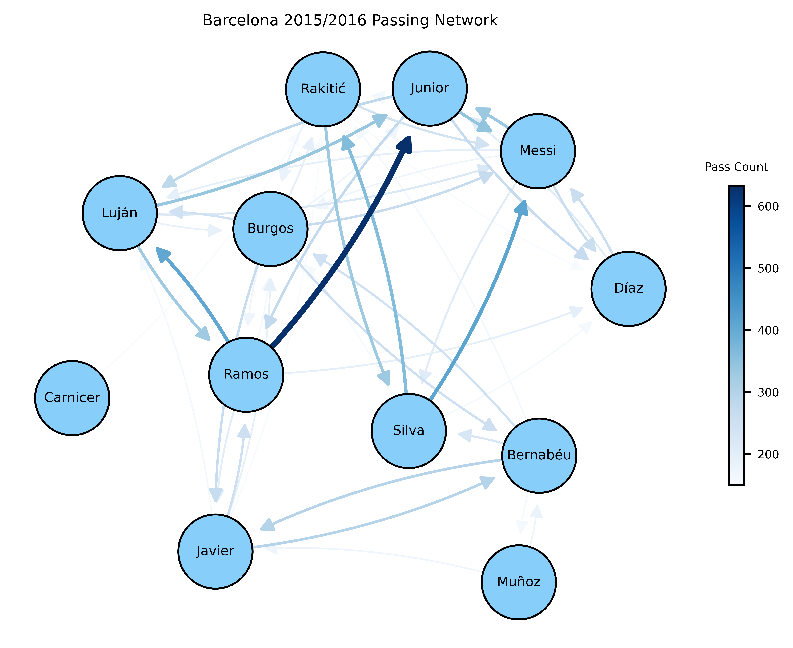
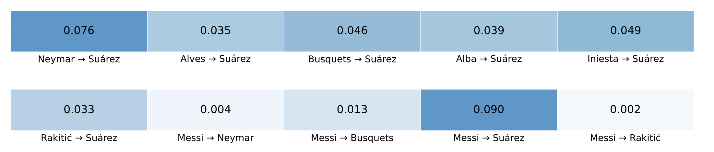

# Soccer Credit Attribution Model

This model uses the [HawkesTorch](https://github.com/ahmrr/HawkesTorch/tree/main) Multivariate Hawkes Model combined with a Branching Probability Equation to estimate shot responsibilities for each shot during a soccer game. This information is then used to expected goal involvements (xGI) for each player. The data used in this repository is from [StatsBomb](https://github.com/statsbomb/open-data.git).

## Project Content
```
Soccer-Network-Models/
├── Data/                       
├── Examples/
│   └── workflow.ipynb           # Example walkthrough notebook       
├── src/
│   ├── analysis.py              # Interpreting Model Result
│   ├── dataCollection.py        # Collects and Cleans Match Data
│   ├── matches.py               # Allows for Season Long Analysis
│   ├── modelFitting.py          # Fits Model and Calculates Shot Responsibilities
│   ├── dataProcessing.py        # Data Processing Functions
│   └── visualization.py         # Generates Various Visualizations 
├── requirements.txt
├── .gitignore
└── README.md
```

## Installation & Setup
**Requirements:** Python 3.8+
 
1. Clone the Repository:
   ```bash
   git clone https://github.com/your-username/Soccer-Credit-Attribution.git
   cd Soccer-Network-Models
   ```
 
2. Install Dependencies:
   ```bash
   pip install -r requirements.txt
   ```

3. Run the Example Workflow
   ```bash
   jupyter notebook Examples/workflow.ipynb
   ```
---
 
## Expected Goal Involvements (xGI)
To better characterize the contribution of multiple passes in the buildup to a shot, we introduce expected goal involvements (xGI), a new statistic that measures a player's involvement in creating goal scoring opportunities based on their passes. Rather than assigning all credit to the final pass, xGI distributes the expected goals (xG) value of a shot among players who contributed to the attacking sequence. For each shot, xGI is calculated by multiplying the shot's xG by a player's estimated responsibility $R_i$.

$$\text{xGI} = \sum_{i=1}^{n} \text{(xG)}_i \cdot R_i$$


---
## Results for Barcelona 2015/2016

### Passing Network
The passing network below visualizes the interactions between players, with nodes representing individual players and edges weighted by passing frequency. This gives an overview of a team's buildup structure.



### Alpha Values
The visualization below shows a subset alpha matrix produced by the Multivariate Hawkes Model, fitted across a full 36 game season. Each cell in the alpha matrix represents the rate at which a pass from a player pair excites a subsequent show by  Luis Suárez.



### Shot Responsibilities
Shot responsibilities are derived using the alpha and mu values provided by HawkesTorch. These values determine how credit is distributed across prior passes leading up to a shot. Below is an example from one shot from Munir at 0:35, where the xG = 0.55

| Time | Event | Responsibility | xGI | $\alpha_{ij}$ |
| :--- | :--- | :---: | :---: | :---: |
| 0:34 | Neymar Pass to Munir | 0.329 | 0.1810 | 0.0013 |
| 0:30 | Suárez Pass to Neymar | 0.268 | 0.1474 | 0.0023 |
| 0:29 | Neymar Pass to Suárez | 0.136 | 0.0748 | 0.0014 |
| 0:26 | Roberto Pass to Neymar | 0.086 | 0.0473 | 0.0016 |
| 0:20 | Mathieu Pass to Roberto | 0.020 | 0.0110 | 0.0013 |

### Top 5 Players by xGI Per Game

| Name | Position | xGI | xGI Per Game |
| :--- | :--- | :---: | :---: |
| Neymar Junior | Left Wing | 15.5 | 0.457 |
| Lionel Messi | Right Wing | 12.4 | 0.376 |
| Luis Suárez | Center Forward | 11.1 | 0.316 |
| Andrés Iniesta | Left Center Midfield | 3.86 | 0.138 |
| Ivan Rakitić | Right Center Midfield | 4.25 | 0.118 |

### xGI Heatmap

To better visualize a player's expected goal involvements (xGI) we can construct heatmaps using this repository. An example is shown below for Lionel Messi across an entire season.  


